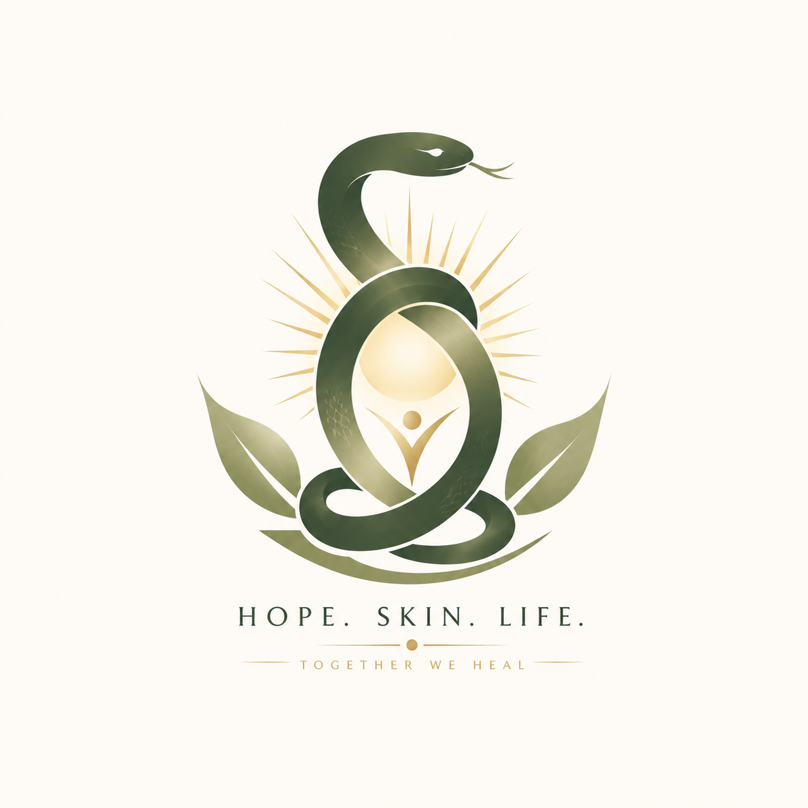
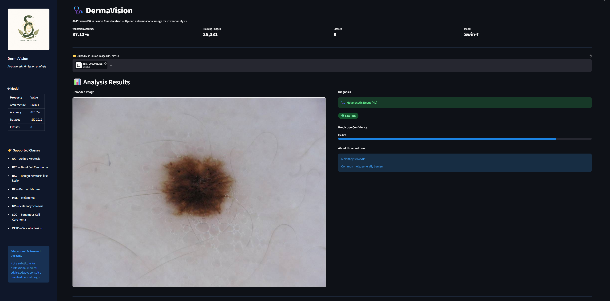
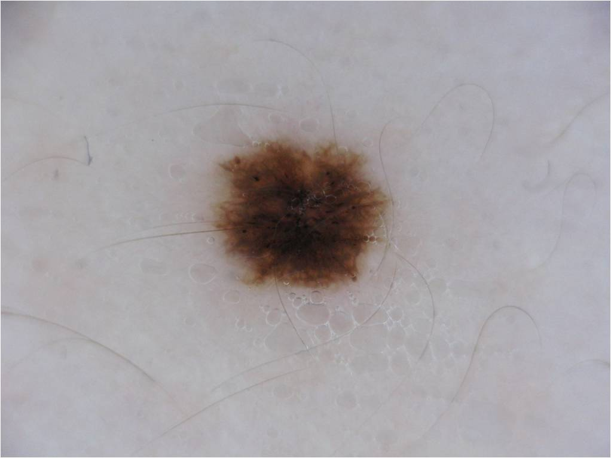
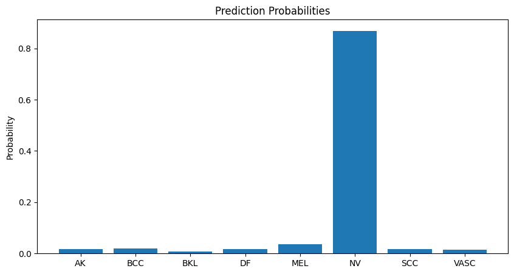
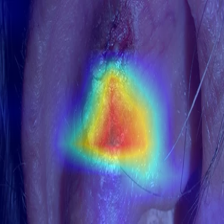
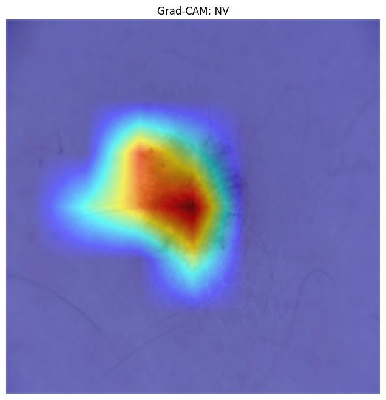
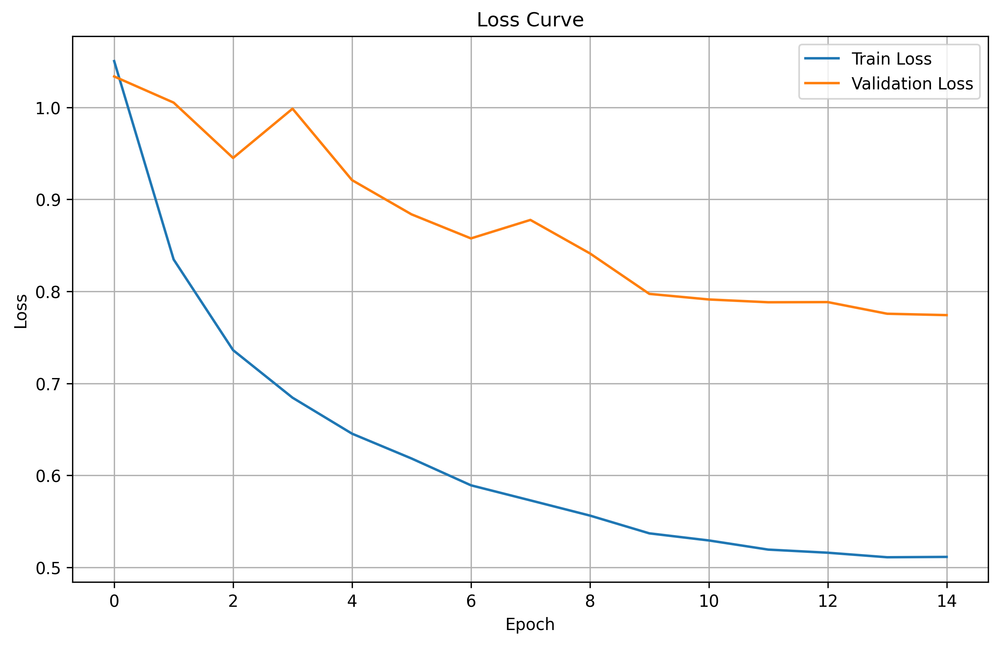
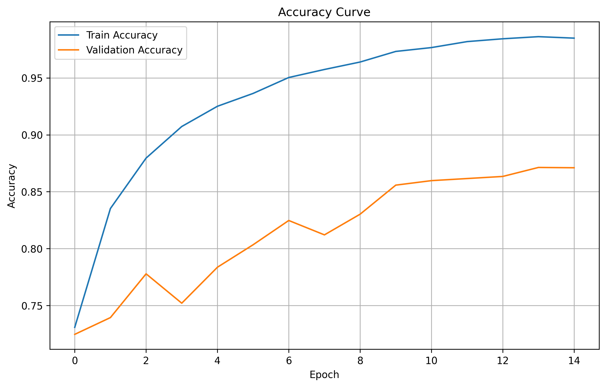
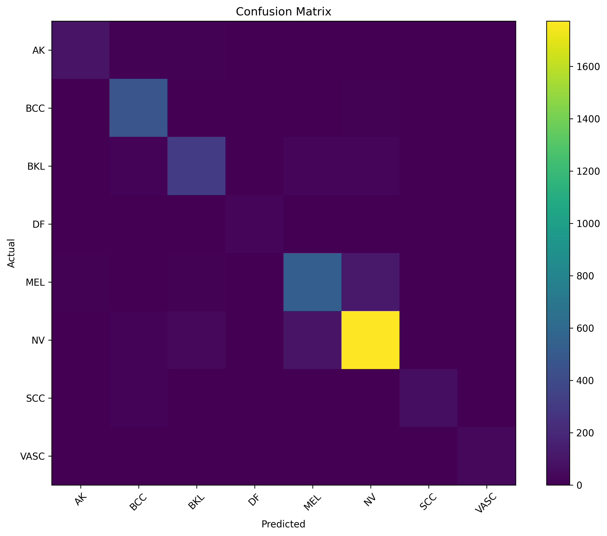

<p align="center">
  
</p>

<h1 align="center">DermaVision</h1>

<p align="center">
  Explainable AI-Based Skin Lesion Classification using Swin Transformer
</p>

<p align="center">
  
  
  
  
  
</p>

---

## Overview

DermaVision is a skin lesion classification platform designed to assist in the early detection and analysis of skin diseases from dermoscopic images. The system uses a fine-tuned **Swin Transformer Tiny** model trained on the **ISIC 2019 Skin Lesion Dataset** to classify lesions into eight clinically relevant categories.

To improve transparency and clinical trust, DermaVision integrates **Grad-CAM (Gradient-weighted Class Activation Mapping)** explainability, producing heatmaps that highlight the image regions most influential to each prediction. The platform also provides per-class probability distributions, automated PDF clinical reports, and an interactive web interface built with Streamlit.

The system is intended for educational and research use and demonstrates how modern vision transformers can be applied to medical image analysis with interpretable outputs.

---

## Dashboard

<p align="center">
  
</p>

The dashboard presents the uploaded dermoscopic image, predicted disease class, confidence score, risk level badge, full probability distribution chart, Grad-CAM heatmap, and a downloadable PDF report — all within a single Streamlit interface.

---

## Features

- AI-powered classification of dermoscopic images into 8 disease categories
- Swin Transformer Tiny fine-tuned on ISIC 2019 (87.13% validation accuracy)
- Grad-CAM heatmap visualization showing model attention regions
- Risk level classification: High / Moderate / Low per predicted class
- Confidence scores and full 8-class probability distribution
- Side-by-side original and heatmap comparison view
- Automated clinical PDF report generation with inline probability bars
- Interactive Streamlit web application with dark UI
- Cloudflare Tunnel support for public deployment from Google Colab
- Git LFS support for model weight storage

---

## Sample Input

<p align="center">
  
</p>

*A representative dermoscopic image from the ISIC 2019 dataset. The model classifies this as Melanocytic Nevus (NV) with 86.88% confidence.*

---

## Prediction Output

<p align="center">
  
</p>

The platform provides a probability score for each of the eight disease classes. The bar chart makes it easy to assess both the primary prediction and alternative diagnostic possibilities. The top three predictions are also presented in a structured table with full disease names and confidence percentages.

---

## Explainability — Grad-CAM

Grad-CAM generates a heatmap by computing the gradient of the predicted class score with respect to the feature maps of the final transformer block. Regions highlighted in warm colours (red, orange, yellow) contributed most strongly to the classification decision, while cooler regions (blue, green) had less influence.

<p align="center">
  
  &nbsp;&nbsp;
  
</p>

The heatmaps are displayed side by side with the original image in the application, enabling direct visual comparison. The underlying implementation uses `pytorch-grad-cam` with a custom reshape transform to handle the non-standard spatial output of the Swin Transformer architecture.

---

## Application Pipeline

The diagram below describes the end-to-end data flow through `app.py`, from image upload to report download.

```
User uploads image
        │
        ▼
┌─────────────────────────────────┐
│       Image preprocessing       │
│  Resize 224×224, normalize,     │
│  convert to tensor              │
└────────────────┬────────────────┘
                 │
                 ▼
┌─────────────────────────────────┐
│    Swin Transformer Tiny        │   ◄── models/swin_tiny_best.pth
│    Forward pass → softmax       │   ◄── artifacts/label_mapping.json
└──────┬──────────┬───────┬───────┘
       │          │       │
       ▼          ▼       ▼
  Top-K        Prob.   Grad-CAM
predictions    dict    heatmap
get_top_       get_    generate_
predictions()  prob_   gradcam()
               dict()
       │          │       │
       └──────────┴───────┘
                 │
                 ▼
┌─────────────────────────────────┐
│      Streamlit UI display       │
│  Diagnosis · Confidence ·       │
│  Chart · Heatmap · Risk badge   │
└────────────────┬────────────────┘
                 │
                 ▼
┌─────────────────────────────────┐
│     PDF report generation       │   ◄── utils/report_generator.py
│     create_pdf_report()         │
│     ReportLab + dark theme      │
└────────────────┬────────────────┘
                 │
                 ▼
        User downloads report
```

### Pipeline modules

| Module | Location | Responsibility |
|---|---|---|
| Model loading | `utils/model_loader.py` | Loads and caches Swin-T weights via `@st.cache_resource` |
| Preprocessing | `utils/inference.py` | Resize, normalize, convert PIL image to tensor |
| Inference | `utils/inference.py` | Forward pass, softmax, top-K extraction, probability dict |
| Explainability | `utils/gradcam.py` | Grad-CAM with reshape transform for Swin Transformer |
| Disease info | `utils/disease_info.py` | Short clinical descriptions for each of the 8 classes |
| Report generation | `utils/report_generator.py` | ReportLab PDF with dark theme, probability bars, images |
| App entrypoint | `app.py` | Streamlit UI, routing, folder creation, all orchestration |

---

## Supported Disease Classes

| Code | Disease | Risk Level |
|------|---------|-----------|
| AK | Actinic Keratosis | Moderate |
| BCC | Basal Cell Carcinoma | High |
| BKL | Benign Keratosis-like Lesions | Low |
| DF | Dermatofibroma | Low |
| MEL | Melanoma | High |
| NV | Melanocytic Nevus | Low |
| SCC | Squamous Cell Carcinoma | High |
| VASC | Vascular Lesion | Moderate |

---

## Model Architecture

| Component | Details |
|---|---|
| Architecture | Swin Transformer Tiny |
| Framework | PyTorch |
| Library | TIMM |
| Dataset | ISIC 2019 |
| Classes | 8 |
| Input resolution | 224 × 224 |
| Explainability | Grad-CAM (pytorch-grad-cam) |
| Target layer | `model.layers[-1].blocks[-1].norm2` |
| Frontend | Streamlit |
| Deployment | Cloudflare Tunnel |
| Model storage | Git LFS |

### Why Swin Transformer?

Standard Vision Transformers (ViT) process images as fixed-size non-overlapping patches using global self-attention, which is computationally expensive. Swin Transformer introduces a hierarchical structure with shifted windowed attention, dramatically reducing computational cost while maintaining strong feature extraction — making it well-suited to high-resolution medical images. The Tiny variant offers a strong accuracy-to-parameter trade-off for classification tasks.

---

## Model Performance

| Metric | Value |
|---|---|
| Validation Accuracy | **87.13%** |
| Total Dataset Images | 25,331 |
| Number of Classes | 8 |

---

## Training Results

### Loss Curve

<p align="center">
  
</p>

The training loss decreases steadily across epochs with validation loss closely tracking, indicating that the model generalises well without significant overfitting. The convergence profile reflects the effectiveness of the Swin Transformer's hierarchical attention mechanism when fine-tuned on dermoscopic data.

### Validation Accuracy Curve

<p align="center">
  
</p>

Validation accuracy climbs consistently from early epochs and stabilises near **87.13%**, demonstrating robust learning across all eight skin lesion categories. This performance is achieved on the full ISIC 2019 test split under standard evaluation conditions.

### Confusion Matrix

<p align="center">
  
</p>

The confusion matrix provides per-class classification accuracy across all eight categories. Strong diagonal values indicate reliable discrimination between classes, particularly for Melanocytic Nevus (NV) which constitutes the largest portion of the dataset. Off-diagonal values reveal expected ambiguity between visually similar lesion types, consistent with dermatology literature.

---

## Technology Stack

| Category | Tools |
|---|---|
| Deep learning | PyTorch, TIMM, Swin Transformer |
| Explainability | pytorch-grad-cam |
| Computer vision | OpenCV, Pillow |
| Data processing | NumPy, Pandas, Matplotlib |
| Web application | Streamlit |
| Report generation | ReportLab |
| Deployment | Cloudflare Tunnel |
| Model storage | Git LFS |

---

## Project Structure

```
DermaVision-WebApp/
│
├── app.py                         # Streamlit application entrypoint
├── requirements.txt               # Python dependencies
│
├── assets/
│   └── logo.png                   # Sidebar logo
│
├── artifacts/
│   └── label_mapping.json         # Index-to-class label mapping
│
├── models/
│   └── swin_tiny_best.pth         # Fine-tuned model weights (Git LFS)
│
├── generated_heatmaps/            # Saved Grad-CAM output images
│
├── generated_reports/             # Generated PDF reports
│
├── results/
│   ├── plots/
│   │   ├── loss_curve.png
│   │   └── accuracy_curve.png
│   └── confusion_matrix/
│       └── confusion_matrix.png
│
├── temp/                          # Temporary uploaded image storage
│
└── utils/
    ├── disease_info.py            # Clinical descriptions per class
    ├── gradcam.py                 # Grad-CAM with Swin reshape transform
    ├── inference.py               # Preprocessing, prediction, top-K
    ├── model_loader.py            # Model weight loading
    └── report_generator.py        # ReportLab PDF generation
```

---

## Dataset

The model was trained and evaluated on the [ISIC 2019 Skin Lesion Dataset](https://challenge.isic-archive.com/landing/2019/), a benchmark dataset for skin lesion analysis containing 25,331 dermoscopic images across eight disease categories.

Raw training data used in this project is available here:
[Google Drive — Raw Dataset](https://drive.google.com/drive/folders/19M34603ors5A7UnLwEKd6KTyfdpJE-Dc?usp=sharing)

> The model weights (`swin_tiny_best.pth`, 105 MB) are tracked with Git LFS. Ensure Git LFS is installed before cloning to download the weights automatically.

---

## Installation

```bash
# Clone the repository (Git LFS required for model weights)
git clone https://github.com/i-mAshura/DhermaVisionAI.git
cd DhermaVisionAI

# Install dependencies
pip install -r requirements.txt
```

---

## Running the Application

```bash
streamlit run app.py
```

To expose publicly via Cloudflare Tunnel (useful when running in Google Colab):

```bash
cloudflared tunnel --url http://localhost:8501
```

For Colab deployment, run Streamlit in a background thread and then start the tunnel:

```python
import subprocess, threading, time

def run_streamlit():
    subprocess.run([
        "streamlit", "run", "app.py",
        "--server.port", "8501",
        "--server.headless", "true",
        "--server.enableCORS", "false",
    ])

t = threading.Thread(target=run_streamlit, daemon=True)
t.start()
time.sleep(10)
subprocess.run(["cloudflared", "tunnel", "--url", "http://localhost:8501"])
```

---

## Disclaimer

This project is intended for **educational, research, and demonstration purposes only**.

DermaVision is not a certified medical device. It must not be used as a substitute for professional dermatological diagnosis, treatment, or medical consultation. All predictions generated by the model should be reviewed and validated by a qualified healthcare professional before any clinical interpretation.

---

## Authors

**K. Sai Abhiram**

Vellore Institute of Technology, VIT-AP University

**K. Madhu Hasini**

National Institute of Technology - Calicut , NIT-C

---

## License

This project is licensed under the [MIT License](LICENSE).

---

<p align="center">
  DermaVision — AI for Explainable Skin Lesion Analysis
</p>
